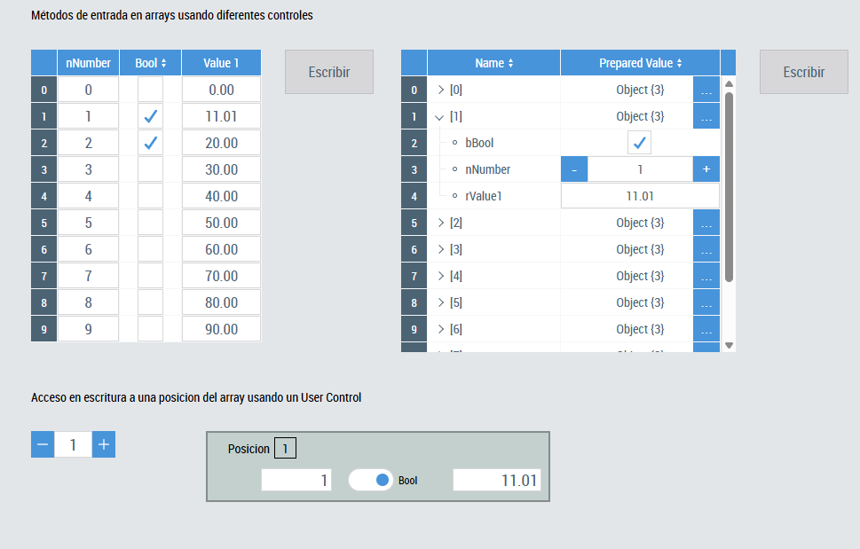

## Descripción
Proyecto de demostración de uso de objetos gráficos para manipular arrays de estructuras de plc mapeado en el HMI.
* **DataGrid**

* **ObjectBrowser**

* **User Control**
  * Usa la función **CreateBindingByIndex()** para vincularlo dinámicamente a una estructura de datos . Para apuntar a la estructura dentro del array se usa también como parámetro un índice.
  * El segundo método usa las funciones **GetElementByIndex()/SetElementByIndex()** para leer/escribir respectivamente.

